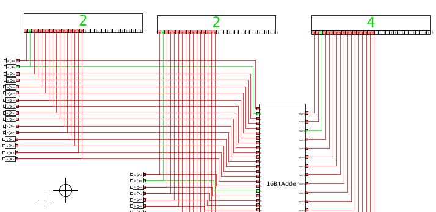
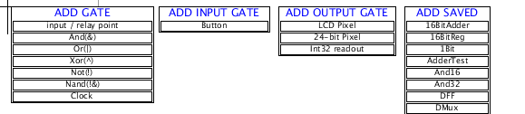
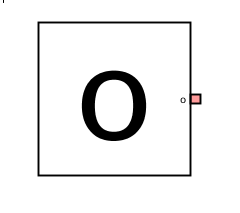
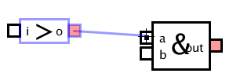
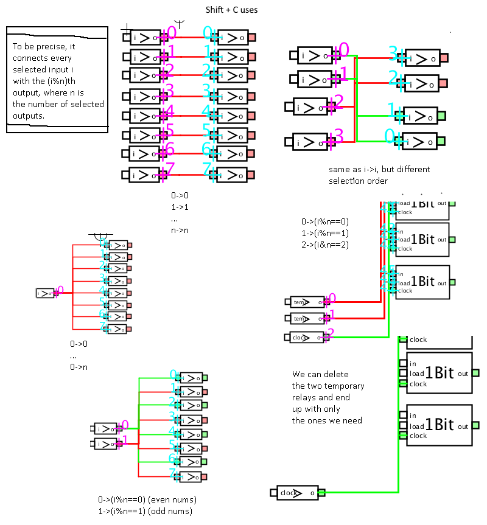
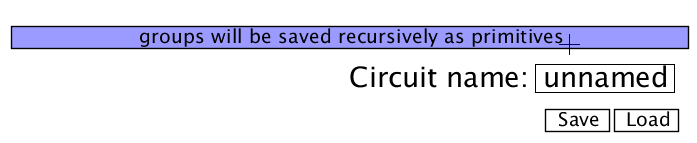
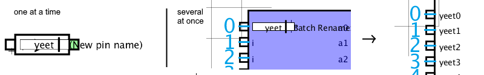
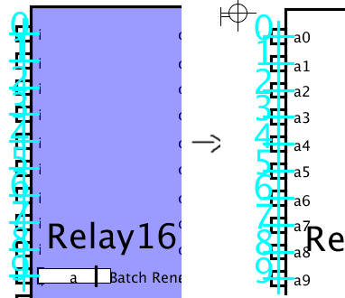

# What is OnesAndZeroes?

It's a logic gate simulator made in processing to help myself understand a second year computer systems university course. Download Processing from the Processing website, then download this entire repository and open OnesAndZeroes.pde in processing and run it in order to use the program.

Sidenote: OnesAndZeroes only uses `true` and `false` to represent gate states, ones and zeroes play no part in this program

### Main Controls:

- Rightclick and drag to move/pan the view, use the mousewheel to zoom in and out.
- Drag a gate to move it. 
- Drag a rectangle to do a rectangle selection (hold `Shift` while doing this to make it additive). 
- Hold right-click on a gate/selection to delete it
- Press `[Shift] D` to duplicate a selection (totally didnt steal that from blender or anything haha)
- Press `[Shift] A` to select all gates
- Press `[Shift] C` to connect the selected inputs and outputs *in the order that they were selected*. Very useful

There are probably more controls out there, the bottom left of the screen will show you what actions you can do at any given moment

## How it works
The overarching goal is to build some sort of computer 'from the ground up' using just primitive logic gates and a clock pulse, but it can be used to just see how gates interact.

The primitive gates are And, Or, Not, Xor, and Nand. The output gates exist to use the signals to produce some sort of output, like a coloured pixel, or a number. They also exist for debugging purposes. There is also a clock gate that pulses at a speed defined by it's input, and relay gates that simply feed the signal forward.

The button gate also exists. It's output is `true` whenever it is clicked. The text displayed is the same as the name of the output pin. I plan to map keyboard keys to buttons at some point.

### Selecting multiple gates
Dragging the mouse over the background will enable you to do a rectangular selection of gates. Selected gates can be dragged or deleted all at once. Holding down `Shift` while selecting things will ensure that the previous selection doesn't get cleared, allowing for additive selection. 

The selection can be duplicated with `Shift+D`, which is probably the best way to create more of the same element.

### Linking I/O pins
The initial way to do this is by dragging from one pin to another:

As you make bigger and bigger circuits, linking pins by dragging from one to the other one by one will get quite frustrating. Instead, you can select several IO pins in the same way that you select gates, and then press `Shift+C` to link the selected inputs to the selected outputs. If there are fewer selected outputs than inputs, the outputs will be looped through again and linked to the remaining inputs. The linking occurs in the order the pins were selected, i.e the first selected output pin will link to the first selected input pin, and so on. 

### Loading, saving, and groups

In order to do things faster, you can save a layout with a name of your choice (can only be letters and numbers though). When saving a file, you have the option to either save groups "recursively as primitives" (which will embed every gate within the group down to the basic ones into the file, meaning that it can be shared more easier), or "as filenames pointing to other savefiles" (which will simply save the group as the filename it was loaded as, reducing filesize and allowing any changes made to those groups to carry over to the next time any circuit using it is loaded).

 You can load a savefile as it's individual parts (Loads the parts as they were saved. Will delete all elements from the current circuit.) by using the Load button with it's name entered in, or you can load it as it's own part from the `ADD SAVED` menu, which will load it as a group, exposing all unused inputs and outputs, and give the group the name it was saved as.

You can no longer manually group objects.

### Naming inputs and outputs, Batch renaming

Possibly the most usefull feature ever. Click on the input/output name, type in something new, and then hit enter. Extremely handy, since creating a group isn't going to make the pins appear in any particular order and it's very easy to lose track of which pin does what otherwise. Pins are ordered by their vertical location for groups.

In order to make renaming faster, you can perform a `Batch Rename`. Select multiple pins, and enter a name for any one of them as normal. Pressing enter will give each pin that name, followed by a number corresponding to it's selection order:

### So you actually read the manual eh?
Thanks! There are still heaps of bugs to remove (probably), but hopefully you won't encounter any of them while you're building your computer. (Don't worry too much about feedback loops within the circuit, the system is quite resilient to those). Good luck!

#### New features in the works:
- sorting saved files alphabetically
- keyboard activated buttons
- better wire wrangling and selecting