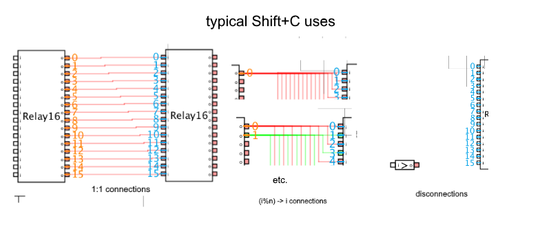

# What is OnesAndZeroes?

It's a logic gate simulator made in processing to help myself understand a second year computer systems university course. Download Processing from the Processing website, then download this entire repository and open OnesAndZeroes.pde in processing and run it in order to use the program.

Sidenote: OnesAndZeroes only uses `true` and `false` to represent gate states, ones and zeroes play no part in this program

## Main Controls:

- Rightclick and drag to move/pan the view, use the mousewheel to zoom in and out.
- Drag a gate to move it. 
- Drag a rectangle to do a rectangle selection (hold `Shift` while doing this to make it additive). Works on gates and pins
- Hold right-click on a gate/selection to delete it. Existing connections will usually be merged, if possible
- Press `[Shift] D` to duplicate a selection, all connections will be preserved
- Press `[Shift] A` to select all gates
- Drag from one pin to another to connect them
- Press `[Shift] C` to connect several selected inputs and outputs *in the order that they were selected*. If no outputs are selected, the inputs will just get disconnected.
- Press `[Shift] F` to connect the selected outputs to all inputs with the same name.
- Use `[Space]`, `[<]`,`[>]` to control time

There are probably more controls out there, the bottom left of the screen will show you what actions you can do at any given moment

### Adding gates

The primitive gates are And, Or, Not, Xor, and Nand. Output gates will take an input, and produce an output that isn't a signal. Any saved circuit can also be loaded as it's own seperate part, with all unconnected input and output pins exposed (see 16BitAdder from above). The pins are ordered based on their vertical position in the group.

More coming soon...

### Loading, saving, and groups

Load and save parts using this menu:

Embedding groups is not reccomended unless sharing the file. When loading a file, embedded gates will take precedence over other saved files, so edits made to parts that appear in another part with it's groups embedded won't be affected (which is undesireable in most cases). More information on the file format can be found in `File Format.md`.

### Naming inputs and outputs, Batch renaming

Click on the input/output name, type in a new name, and then hit enter. Names are used to keep track of pins. Selecting multiple of the same kind of pin will enable a "batch rename", which will also ad a number to the name based on selection order:

### Linking I/O pins
Drag one pin to another (works both ways):

For larger circuits, this will take too long. Instead, you can rect-select several IO pins, and then press `Shift+C` to link them as shown (The ith selected input will be linked with the (i%n)th selected output, where n is the number of selected outputs).

## The Aim
The overarching goal is to build some sort of computer 'from the ground up' using just primitive logic gates and a clock pulse, but it can be used to just see how gates interact.

 Good luck!

#### New features in the works:
- sorting saved files alphabetically instead of having just one super long menu
- keyboard activated buttons
- better wire wrangling and selecting
